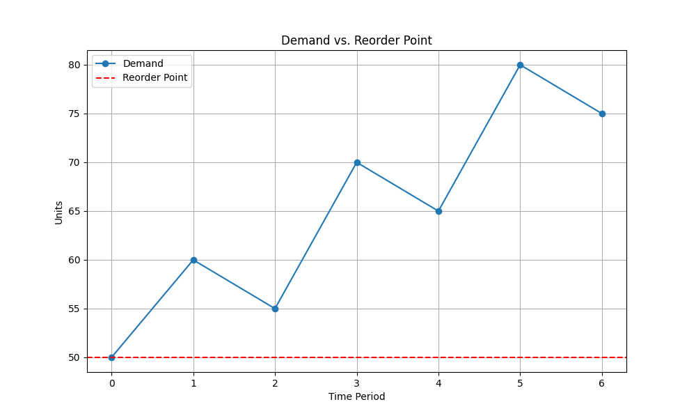
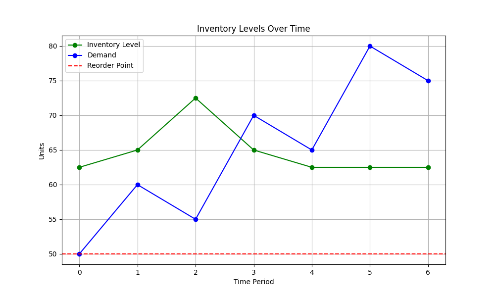

# Inventory Optimization using Differential Evolution

This project demonstrates how to optimize inventory management using the **Differential Evolution (DE)** algorithm in Python. The goal is to minimize total inventory costs by finding optimal values for the reorder point and order quantity.

---

## Why is it needed?

Efficient inventory management is critical for businesses to minimize costs while meeting customer demand. This project models a typical inventory problem with parameters such as:

- **Demand**: Known or estimated product demand for each period.
- **Ordering Cost**: The fixed cost incurred for placing an order.
- **Holding Cost**: The cost of holding inventory per unit.
- **Shortage Cost**: The penalty cost for unmet demand.

We use the **Differential Evolution** algorithm from the SciPy library to optimize these parameters.

---

## How the Code Works

### `inventory_cost.py`
This module defines the **objective function**:
- The function calculates the total cost for a given reorder point and order quantity.
- Costs include ordering, holding, and shortage costs.
- The function simulates inventory levels for each period and accumulates costs.

### `simulate_inventory.py`
This module simulates the inventory levels over time:
- It uses the optimal reorder point and order quantity to determine when to place orders.
- The simulation outputs a list of inventory levels across time periods.

### `plot.py`
This module provides visualization functions:
- `plot_demand_and_reorder_point`: Visualizes the demand and optimal reorder point.
- `plot_inventory_levels`: Simulates and visualizes inventory levels alongside the demand.

### `main.py`
The main script ties everything together:
1. Defines the problem parameters (e.g., demand, costs, and variable bounds).
2. Uses the `differential_evolution` function to optimize the reorder point and order quantity.
3. Simulates inventory levels and visualizes the results.

---

## Running the code & Libraries Used

1. PyCharm was used & the following libraries
   - `numpy`
   - `scipy`
   - `matplotlib`

---

## Example Output

### **1. Demand (`demand`)**
```python
demand = [50, 60, 55, 70, 65, 80, 75]
```
- This is a list of demand values for each time period (days, weeks, etc)
- For 7 periods:
  - In period 1, demand is 50 units,
  - In period 2, demand is 60 units,
  -  ...

### **2. Ordering Cost (`ordering_cost`)**
```python
ordering_cost = 100
```
- Fixed cost incurred every time an order is placed.
- A company pays $100 for delivery and processing, regardless of the order size.
- Higher ordering costs incentivize placing fewer but larger orders.

### **3. Holding Cost (`holding_cost`)**
```python
holding_cost = 2
```
- Cost of holding one unit of inventory per time period.
- If holding one unit costs $2 per period, keeping 50 units in storage for a week costs 100.
- This encourages maintaining lower inventory levels to minimize storage costs.

### **4. Shortage Cost (`shortage_cost`)**
```python
shortage_cost = 5
```
- Penalty cost incurred per unit of unmet demand.
- If a customer’s demand isn’t met, it costs $5 per missing unit.
- This motivates maintaining enough inventory to avoid customer dissatisfaction or lost sales.

### **5. Bounds for Decision Variables (`bounds`)**
```python
bounds = [
    (10, 100),  # Reorder Point (min, max)
    (20, 200)   # Order Quantity (min, max)
]
```
- **Reorder Point**: Inventory level threshold at which a new order is triggered.
  - Min value: 10 units.
  - Max value: 100 units.
- **Order Quantity**: The number of units ordered when placing an order.
  - Min value: 20 units.
  - Max value: 200 units.
- These bounds limit the search space for the optimization algorithm.

## **Example Scenario & Graph**

- A store expects customer demand for a product over 7 weeks.
  - $100 per order as a fixed cost.
  - $2 per unit held in storage per week.
  - $5 penalty per unit of unmet demand.
- The store’s management wants to:
  - Place orders when inventory drops between 10 and 100 units.
  - Order quantities between 20 and 200 units.

The program will export **two** plots:
- **Demand**: The number of units required in each time period.
- **Reorder Point**: The optimal threshold at which new inventory is ordered.



- **Inventory Level**: The remaining stock in each period.
- **Demand**: The number of units requested by customers.
- **Reorder Point**: The threshold that triggers a new order.



---

## Contribution

1. **Razvan Ruxandari**
    - Approach to implement the algorythm logic
    - Implementation
    - Documentation
2. **Petrescu-Miron Stefanel**
    - Found the subject to work on using the DE algorythm
    - Implementation
    - Documentation

---


